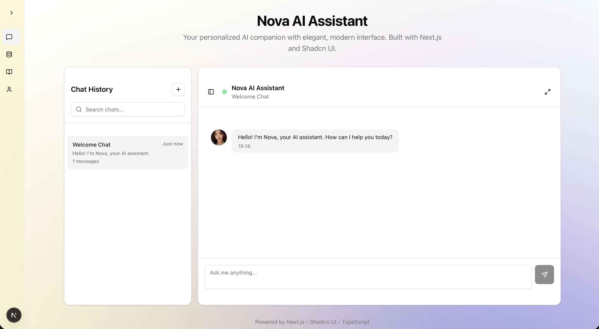

# Nova AI Assistant

A modern, elegant AI assistant interface built with Next.js and Shadcn UI, featuring personalized interactions and knowledge management capabilities.



## ✨ Features

### 🤖 Core Chat Interface
- **Modern Chat UI**: Clean, responsive chat interface with message history
- **Real-time Interactions**: Smooth conversation flow with typing indicators
- **Message Management**: View and manage conversation history

### 🎭 Personalized Persona System
- **Configurable Personality**: Customize assistant traits (Calm, Curious, Empathetic)
- **Dynamic Role Prompting**: Adaptive responses based on persona settings
- **Bilingual Support**: English and 中文 language capabilities

### 🧠 Knowledge Management
- **Knowledge Sources**: Add and manage embedded knowledge from multiple sources
- **Website Crawling**: Index content from website URLs
- **Document Upload**: Support for PDF, DOCX, TXT, and MD files
- **Vector Index Status**: Monitor indexing status (Indexed, Stale, Processing)
- **Reindexing**: Update stale knowledge sources with one click

### 🎨 Modern UI/UX
- **Collapsible Sidebar**: Smooth, responsive navigation with collapse/expand functionality
- **Shadcn UI Components**: Consistent, accessible design system
- **Dark/Light Theme**: Built-in theme support
- **Minimalist Design**: Clean, distraction-free interface with subtle gradients

### 📱 Responsive Design
- **Mobile-First**: Optimized for all screen sizes
- **Smooth Animations**: CSS transitions and hover effects
- **Accessibility**: WCAG compliant components

## 🚀 Quick Start

### Prerequisites
- Node.js 18+
- npm or yarn

### Installation

1. **Clone the repository**
   ```bash
   git clone <repository-url>
   cd nova-ui
   ```

2. **Install dependencies**
   ```bash
   cd nova-ui-frontend
   npm install
   ```

3. **Run the development server**
   ```bash
   npm run dev
   ```

4. **Open your browser**
   Navigate to [http://localhost:3000](http://localhost:3000)

## 📁 Project Structure

```
nova-ui-frontend/
├── src/
│   ├── app/                 # Next.js App Router pages
│   │   ├── knowledge/       # Knowledge management page
│   │   ├── layout.tsx       # Root layout with sidebar
│   │   └── page.tsx         # Main chat page
│   ├── components/          # React components
│   │   ├── ui/              # Shadcn UI components
│   │   ├── chat-interface.tsx
│   │   ├── navigation.tsx   # Collapsible sidebar
│   │   └── persona-settings.tsx
│   └── stores/              # Zustand state management
│       ├── chat-store.ts
│       ├── persona-store.ts
│       └── sidebar-store.ts
└── package.json
```

## 🛠️ Technology Stack

- **Framework**: Next.js 15 with App Router
- **Language**: TypeScript
- **Styling**: Tailwind CSS
- **UI Components**: Shadcn UI + Radix UI
- **State Management**: Zustand
- **Icons**: Lucide React
- **Font**: Nunito Sans

## 📊 Screenshots

### Chat Interface


*Modern chat interface with message history and responsive design*

### Knowledge Management


*Manage embedded knowledge sources with indexing status*

### Persona Settings


*Customize AI assistant personality traits and preferences*

### Environment Variables
Create a `.env.local` file in the `nova-ui-frontend` directory:

```env
# Add your environment variables here
NEXT_PUBLIC_API_URL=your-api-url
```

### Customization
- Modify persona traits in `src/stores/persona-store.ts`
- Update color scheme in `tailwind.config.js`
- Add new UI components using Shadcn CLI

## 📄 License

This project is licensed under the MIT License - see the LICENSE file for details.

---

**Nova AI Assistant** - Building a deeply personalized, agentic second brain for modern AI interactions.
